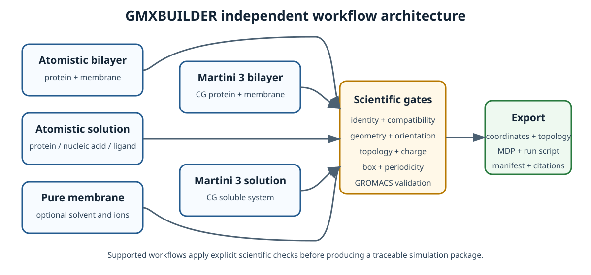

<p align="center">
  
</p>

<h1 align="center">GMXBUILDER</h1>

<p align="center"><strong>English</strong> · <a href="README.zh-CN.md">简体中文</a></p>

GMXBUILDER is a Web, command-line, and HTTP API application for preparing
checkpointed GROMACS simulation packages. It supports atomistic membrane,
pure-bilayer, and solution systems, together with dedicated Martini 3 bilayer
and solution workflows. A successful build produces coordinates, topology,
simulation parameters, a run script, a manifest, and method citations.

<p align="center">
  
</p>

## Workflows

| Workflow | Supported system |
|---|---|
| Bilayer Builder | Atomistic membrane protein, mixed or pure bilayer, water, and ions |
| Pure Bilayer System | Protein-free atomistic bilayer, optionally without solvent |
| Solvator | Atomistic protein, supported canonical DNA/RNA, and compatible non-covalent ligands in solution |
| Martini 3 Bilayer Builder | Standard coarse-grained protein in a flat symmetric or asymmetric bilayer |
| Martini 3 Solvent Builder | Standard coarse-grained protein in water and ions |

Every **Check** saves the exact coordinates shown in the Viewer. Later steps
consume that checkpoint, and Build packages the final confirmed system without
re-running coordinate construction. Unsupported force-field combinations,
chemical identities, modifications, and molecular classes are reported rather
than silently approximated.

## Quick start

Bootstrap requirements:

- Linux and Python 3.10 or later;
- CMake, a C++17 compiler, and Python's `venv` module;
- Internet access during first installation;
- the NVIDIA CUDA toolkit only for a CUDA-accelerated managed GROMACS build.

Clone the public repository and run the installer:

```bash
git clone https://github.com/AkaseToshiyuki/GMX-BUILDER.git
cd GMX-BUILDER
./install-local.sh
```

The installer reuses a compatible GROMACS 2026.0-or-newer executable or builds
the verified official GROMACS 2026.3 source locally, installs a managed
GAFF2/AM1-BCC runtime, retrieves separately distributed force-field data and
the prebuilt lipid archive from pinned HTTPS sources, verifies SHA-256 digests,
installs Python dependencies, populates the user cache, and starts the local
service. Git LFS, root access, and a GitHub access token are not required.
The default invocation is unattended and uses safe local settings. Use
`./install-local.sh --help` for explicit address, port, CPU, queue, or optional
interactive configuration.

Open <http://127.0.0.1:7788/>. Save the displayed Task ID; it is the only key
needed to resume an unexpired task or download a completed package again.

## Command line and API

Inspect the installed capabilities before choosing a force-field combination:

```bash
gmxbuilder --version
gmxbuilder list-ff
gmxbuilder list-water
gmxbuilder list-lipids
gmxbuilder lipid-library status
gmxbuilder --help
```

The complete YAML/CLI workflow and examples are documented in the user manual.
When the service is running, request and response schemas are available from
`/docs` and `/openapi.json`; the installed schema is authoritative.

## Output and scientific boundary

A solvated package normally contains `input.gro`, `topol.top`, `index.ndx`,
the required force-field and molecule parameter files, editable MDP stages,
`run_md.sh`, `README.txt`, a manifest, and citations. Exact contents depend on
the chosen workflow and molecules. Dry bilayer exports intentionally omit
solvent-only simulation stages.

Passing the automated checks means the package is structurally and
topologically ready to enter minimization and staged equilibration. It does not
prove a biological orientation, protonation state, phase, parameter choice, or
converged production trajectory. Review the final coordinates, total charge,
force-field compatibility, and generated citations before simulation.

## Documentation

- [User Manual V1.0.4](docs/GMXBUILDER_USER_MANUAL_V1.0.4.md)
  ([PDF](docs/GMXBUILDER_USER_MANUAL_V1.0.4.pdf))
- [Scientific Compatibility and Limitations](docs/SCIENTIFIC_COMPATIBILITY.md)
- [Licensing](LICENSING.md)
- [Third-Party Notices](THIRD_PARTY_NOTICES.md)

## Citation and license

If GMXBUILDER supports published work, cite the software and all method,
force-field, water-model, and parameterization references listed in the
exported `CITATIONS.json`. Repository citation metadata is provided in
[`CITATION.cff`](CITATION.cff).

Original GMXBUILDER code and documentation are licensed under the GNU General
Public License v3.0 or later. Distributed modified versions must remain under
the GPL and provide their corresponding source; proprietary derivatives are
not permitted. Scientific data, force fields, generated parameters, and
external programs retain their upstream licenses and citation requirements.
See the licensing guide and third-party notices before redistribution.
