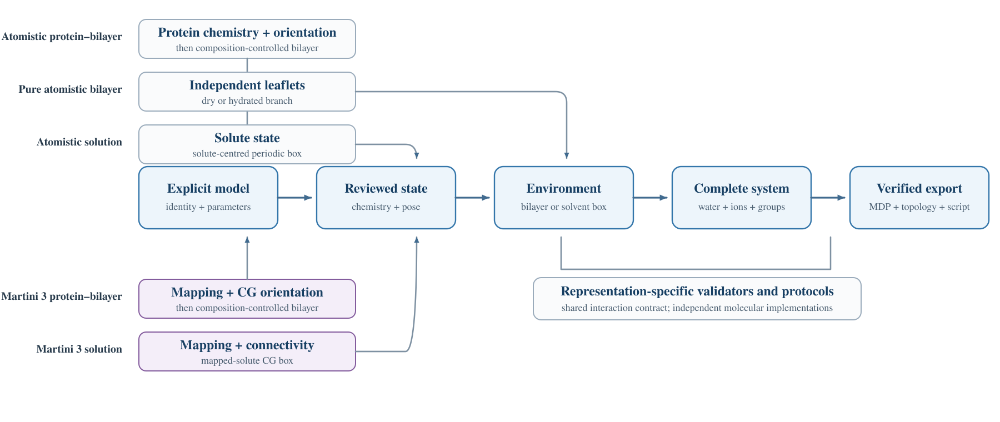

<p align="center">
  
</p>

<h1 align="center">GMXBUILDER</h1>

<p align="center"><a href="README.md">English</a> · <strong>简体中文</strong></p>

**当前正式版：1.0.0。** [发布文件与安装目录](docs/RELEASE.zh-CN.md)。

GMXBUILDER 是用于准备 GROMACS 模拟体系的网页、命令行和 HTTP API 应用。它支持原子级膜体系、纯脂质双分子层、溶液体系，以及独立的 Martini 3 膜和溶液工作流。构建结果包括坐标、拓扑、模拟参数、一键运行脚本、清单和方法引用。

<p align="center">
  
</p>

## 工作流

| 工作流 | 支持的体系 |
|---|---|
| Bilayer Builder | 原子级膜蛋白、纯膜或混合膜、水和离子 |
| Pure Bilayer System | 无蛋白原子级双分子层，可选择不添加溶剂 |
| Solvator | 原子级蛋白、受支持的标准 DNA/RNA 及兼容非共价配体的溶液体系 |
| Martini 3 Bilayer Builder | 平面对称或非对称膜中的标准粗粒化蛋白 |
| Martini 3 Solvent Builder | 水和离子中的标准粗粒化蛋白 |

每次 **Check** 都保存 Viewer 中显示的精确坐标，后续步骤只读取该检查点；Build 直接打包最终确认体系，不会重新执行坐标构建。不兼容的力场组合、化学身份、修饰或分子类别会明确报告，不会静默近似。

## 快速开始

### 脂质资产支持范围

**V4 脂质库** 提供 **37 个已验收的脂质/后端组合**，包含 134,000 个初始化构象。另附的 67 份 GAFF2 参数缓存与构象验收分开：已有参数缓存不代表该脂质已可用于膜构建。具体组合与验证范围见[发布支持清单](docs/release-support.zh-CN.md)。未验收或不兼容的组合继续保持不可用；使用已验收子集无需等待整个 V4 库完成。

这些资产用于初始构建，不代表膜体系已达到热力学平衡或生产采样已收敛。每个新构建体系仍需单独平衡。

### 安装

引导环境要求：

- Linux x86-64 与 Python 3.10 或更高版本；
- CMake、C++17 编译器及 Python `venv` 模块；
- 首次安装时能够访问网络；
- 受管理 Web 服务需要 systemd、cgroup v2、Landlock ABI 3+ 和 FUSE3，详见[安装要求](docs/USER_MANUAL.zh-CN.md#21-引导环境要求)；
- 只有构建 CUDA 加速的受管理 GROMACS 时才要求 NVIDIA CUDA Toolkit。

克隆公开仓库并运行安装器：

```bash
git clone --branch v1.0.0 --depth 1 https://github.com/AkaseToshiyuki/GMX-BUILDER.git
cd GMX-BUILDER
./install-local.sh
```

安装器会复用兼容的 GROMACS 2026.0 及以上版本，或从经校验的官方 GROMACS 2026.3 源码自动构建；它还会配置受管理的 GAFF2/AM1-BCC 运行时，从固定 HTTPS 来源获取单独分发的力场数据和预构建脂质归档，校验 SHA-256，安装 Python 依赖，写入用户缓存并启动本地服务。安装过程不要求 GitHub Token、Git LFS 或 root 权限。默认命令全程无人值守并使用安全的本机设置；运行 `./install-local.sh --help` 可查看地址、端口、CPU、队列和可选交互配置。

服务缺省监听 `127.0.0.1:7788`。`local` / `trusted-lan` 模式下，无认证的非回环监听需要显式 `--allow-unsafe-deployment`，且只能用于受保护的私有网络。公网模式另分为要求全局认证的 `public` 和要求受管理隔离的 `public-anonymous`；两者均须配置可信 TLS 代理和明确的 HTTPS 来源。详见[部署配置](docs/USER_MANUAL.zh-CN.md#附录-a部署配置)。

浏览器访问 <http://127.0.0.1:7788/>。请保存页面显示的 Task ID；它用于恢复保留期内的任务或重新下载已经完成的压缩包。

## 命令行与 API

选择力场组合前先查询当前安装的真实能力：

```bash
gmxbuilder --version
gmxbuilder list-ff
gmxbuilder list-water
gmxbuilder list-lipids
gmxbuilder lipid-library status
gmxbuilder --help
```

完整 YAML/CLI 流程和示例见用户手册。服务运行时，`/docs` 与 `/openapi.json` 提供请求和响应模式；应以当前安装返回的模式为准。

## 输出与科学边界

湿体系的根目录包含 `README.txt`、`manifest.json`、`CITATIONS.json` 和 `run_md.sh`；坐标与索引位于 `structure/`，拓扑及参数位于 `topology/`，模拟阶段位于 `mdp/`。干纯膜省略水、离子及运行阶段。清单记录输入哈希、构建设置、版本和输出校验值。保留原始输入与匹配的参数来源以便重建；上传文件不随下载包分发。

通过自动检查表示压缩包在结构和拓扑层面可以进入能量最小化与分阶段平衡，不代表生物学朝向、质子化状态、相态、参数选择或生产轨迹已经正确或收敛。模拟前仍需复核最终坐标、总电荷、力场兼容性和生成的引用。

## 文档

- [用户手册 — 1.0.0](docs/USER_MANUAL.zh-CN.md)
  （[PDF](docs/USER_MANUAL.zh-CN.pdf)）
- [科学兼容性与能力边界](docs/SCIENTIFIC_COMPATIBILITY.zh-CN.md)
- [许可证说明](LICENSING.zh-CN.md)
- [第三方声明](THIRD_PARTY_NOTICES.zh-CN.md)

## 引用与许可证

如果 GMXBUILDER 支持了公开研究，请引用本软件以及导出 `CITATIONS.json` 中列出的方法、力场、水模型和参数化文献。仓库引用元数据见 [`CITATION.cff`](CITATION.cff)。

GMXBUILDER 原创代码与文档使用 GNU General Public License v3.0 或更高版本。公开分发的修改版本必须继续使用 GPL 并提供对应源代码，不允许闭源衍生。科学数据、力场、生成参数和外部程序仍保留各自上游许可证与引用要求；再分发前请阅读许可证说明与第三方声明。
